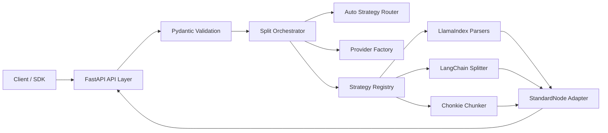
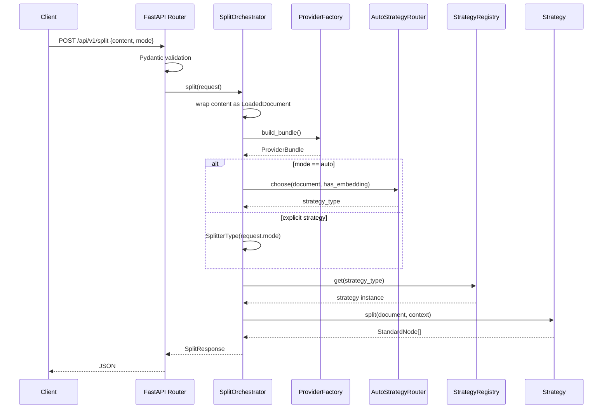

# Universal Document Parsing & Splitting Gateway 详细设计

## 1. 背景与目标

本项目基于 README 中的初始设想，构建一个以 FastAPI/uv 为工程底座的通用文档解析与切分网关。当前版本将 `/api/v1/split` 简化为只接收文档内容 `content` 与切分模式 `mode`，不再支持文件上传、base64 文件内容或 URL 文件地址。

核心目标：

- 统一入口：提供 `/api/v1/split` 对纯文本内容做解析切分。
- 简化契约：请求体只保留 `content` 和 `mode`，降低调用与维护成本。
- 策略解耦：通过策略模式和注册表管理 File-Based、Text-Splitters、Relation-Based 三类策略。
- 框架适配：直接使用 LlamaIndex Core、LangChain Text Splitters、Chonkie 已实现的 parser/splitter，项目只维护实例化与输出标准化逻辑。
- 供应商解耦：LLM 与 Embedding 配置通过 `.env`/环境变量注入，不与 API 请求体或策略实现硬绑定。
- 工程可维护：分层架构、Pydantic DTO、可测试的业务服务、清晰的部署资产。

非目标：

- 当前版本不在 `/split` 中接收文件、URL、base64 内容、策略参数或 provider 配置。
- 当前版本不承诺完全复刻所有 LlamaIndex/LangChain 内部节点字段。
- 当前版本不在服务端持久化节点结果或模型凭据。
- 当前版本不内置鉴权；生产环境应在网关、反向代理或 API Gateway 层启用鉴权与限流。

## 2. 总体架构



## 3. 工程目录

```text
splitter/
├── docs/
│   ├── api-design.md
│   ├── deployment.md
│   ├── openapi.yaml
│   ├── splitter-logs.md
│   ├── splitter-tasks.md
│   └── technical-design.md
├── src/
│   ├── api/
│   ├── core/
│   ├── app.py
│   ├── models/
│   ├── providers/
│   ├── services/
│   └── strategies/
├── tests/
├── Dockerfile
├── docker-compose.yml
├── main.py
└── pyproject.toml
```

## 4. 分层职责

| Layer | Module | Responsibility |
|---|---|---|
| API | `api` | FastAPI 路由、异常映射、响应模型声明 |
| Models | `models` | Pydantic 请求/响应 DTO 与领域数据结构 |
| Services | `services` | 切分编排、自动策略路由 |
| Strategies | `strategies` | NodeParser/Splitter 的注册、构造、执行与标准化适配 |
| Providers | `providers` | LLM/Embedding 环境配置解析 |
| Core | `core` | 配置、异常与应用工厂依赖 |

## 5. 设计模式

### 5.1 Strategy Pattern

所有切分器实现统一 `BaseSplitterStrategy.split(document, context)` 协议。API 层不感知底层策略来自 LlamaIndex、LangChain 还是 Chonkie。

### 5.2 Registry / Factory Pattern

`StrategyRegistry` 维护策略名称到策略实例的映射，`ProviderFactory` 从环境变量构造标准化 `ProviderHandle`。新增策略时只需要注册策略，不需要修改路由或编排器。

### 5.3 Adapter Pattern

不同底层框架的节点结构被转换为 `StandardNode`。API 返回结构稳定，避免调用方绑定 LlamaIndex 或 LangChain 的内部对象。

### 5.4 Orchestrator Pattern

`SplitOrchestrator` 负责串联内容封装、供应商解析、策略选择、策略执行和响应构造。策略类只关注切分算法，避免承担 API 与 I/O 责任。

## 6. 数据模型概览

核心 Pydantic 模型：

- `SplitRequest`：切分请求，只包含 `content` 与 `mode`。
- `ProviderConfig`：模型供应商配置结构，由环境变量解析后在内部使用，敏感字段不回显。
- `StandardNode`：统一节点 DTO，包含文本、元数据、位置、关系和内容 hash。
- `SplitResponse`：标准响应，包含请求 ID、模式、策略、节点数量、节点列表和耗时。

`SplitRequest` 的当前契约：

```python
class SplitRequest(BaseModel):
    content: str
    mode: str = "auto"
```

`mode` 可取值为 `auto` 或任一注册策略名称，例如 `MarkdownNodeParser`、`TokenTextSplitter`、`SemanticSplitterNodeParser`。

## 7. 策略矩阵

| Family | Strategy | Current Backend | Notes |
|---|---|---|---|
| File-Based | `SimpleFileNodeParser` | LlamaIndex | 通用内容解析 |
| File-Based | `HTMLNodeParser` | LlamaIndex | HTML 节点解析 |
| File-Based | `JSONNodeParser` | LlamaIndex | JSON 节点解析 |
| File-Based | `MarkdownNodeParser` | LlamaIndex | Markdown 节点解析 |
| Text-Splitters | `CodeSplitter` | LlamaIndex | 代码切分 |
| Text-Splitters | `LangchainNodeParser` | LlamaIndex + LangChain | 包装 `RecursiveCharacterTextSplitter` |
| Text-Splitters | `Chunker` | Chonkie | 轻量适配 `RecursiveChunker` |
| Text-Splitters | `SentenceSplitter` | LlamaIndex | 句子切分 |
| Text-Splitters | `SentenceWindowNodeParser` | LlamaIndex | 句子窗口节点 |
| Text-Splitters | `SemanticSplitterNodeParser` | LlamaIndex + OpenAIEmbedding/MockEmbedding | 配置 embedding 时使用真实语义切分，未配置时使用本地 MockEmbedding |
| Text-Splitters | `TokenTextSplitter` | LlamaIndex | Token 切分 |
| Relation-Based | `HierarchicalNodeParser` | LlamaIndex | 层级节点解析 |

所有策略均直接调用 LlamaIndex Core、LangChain Text Splitters 或 Chonkie 已实现的 parser/splitter，再通过 adapter 转回 `StandardNode`。项目不维护自研切分 fallback；依赖缺失或 parser 参数错误会返回明确的 `STRATEGY_EXECUTION_ERROR`。

## 8. 自动路由规则

`auto` 模式仅基于 `content` 做低成本启发式判断：

1. 内容可被 JSON 解析时，选择 `JSONNodeParser`。
2. 内容具有明显 HTML 标签时，选择 `HTMLNodeParser`。
3. 内容包含 Markdown 标题、列表或 fenced code block 时，选择 `MarkdownNodeParser`。
4. 内容包含大量代码结构标记时，选择 `CodeSplitter`。
5. 服务端已配置真实 embedding 时，选择 `SemanticSplitterNodeParser`。
6. 其他文本回退到 `SentenceSplitter`。

## 9. 核心时序



## 10. 错误模型

| HTTP Status | Code | Scenario |
|---:|---|---|
| 400 | `UNSUPPORTED_STRATEGY` | 策略名未注册或不可用 |
| 400 | `STRATEGY_EXECUTION_ERROR` | 底层 parser 构造或执行失败 |
| 422 | FastAPI validation | `content` 缺失、空字符串、`mode` 非法或请求包含额外字段 |
| 500 | `INTERNAL_ERROR` | 未预期异常 |

## 11. 安全与治理

- `/split` 不再主动下载 URL，避免服务端 SSRF 面。
- 请求体大小由部署层和 ASGI Server 控制。
- `api_key` 等敏感字段只从环境变量读取，不写入响应与日志。
- 生产环境建议在反向代理层开启 TLS、认证、速率限制和请求大小限制。

## 12. 可观测性

响应中默认包含：

- `request_id`
- `processing_time_ms`
- `strategy_applied`

生产环境可进一步接入：

- FastAPI access log
- OpenTelemetry tracing
- Prometheus 指标
- 结构化 JSON 日志

## 13. 扩展新策略

1. 在 `src/strategies/framework.py` 中新增 `FrameworkStrategySpec`。
2. 提供 parser builder，优先直接引用底层框架类。
3. 在 `StrategyRegistry.default()` 中注册策略描述。
4. 为策略新增 API 或 registry 测试。
5. 更新 `docs/openapi.yaml` 中的 `SplitterType` enum 和 `docs/api-design.md`。
